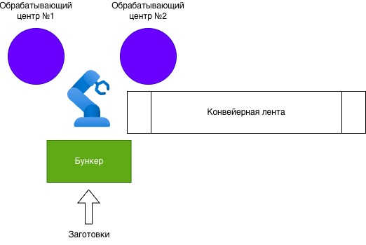

# Домашнее задание №2 "Имитационное моделирование технологических производственных процессов"

**Выполнил: Стремин Валентин РК9-81Б**

Имеется производственный участок с двумя одинаковыми обрабатывающими центрами. Они расположены так, чтобы их загрузку мог осуществлять один робот-манипулятор. В его рабочей зоне также расположен бункер, в который поступают заготовки деталей (детали одного класса, но разных типоразмеров), а также конвейерная лента, на которую он должен поместить обработанные детали. Заготовки поступают с интервалами времени, соответствии заданным по варианту законом распределения. Все возможные перемещения робота описываются равномерным законом распределения с параметрами: [10; 10 + месяц рождения]. Время обработки деталей определяется также равномерным законом распределения с параметрами: [200 – день рождения – месяц рождения; 200].
Разработать программу, реализующую дискретно-событийную принцип имитационного моделирования. Определить коэффициенты загрузки станков и робота. Рассчитать среднюю длину очереди заготовок и время ожидания в очереди.

НУ:

- Распередление: правотреугольное
- Параметры: left, right
- left: 100
- right: 100 + 29 + 1 = 130
- Перемещения робота: равномерный [10; 10 + 1]
- Время обработки: равномерный [200 - 29 - 1; 200]

Решение:

Два обрабатывающих центра => ресурс 2.
Один робот => ресурс 1.

Нужно отслеживать занятость станков и занятость робота.

- Dev MACHINING_CENTER 2
- 0:
- 1: GENERATE правотреугольное [100; 130] (сгенерели транзакт)
- 2: SIEZE ROBOT (пытаемся захватить робота)
- 3: ADVANCE равномерный [10; 11] (робот соверщает перемещение с заготовкой к станку)
- 4: RELEASE ROBOT (освобождаем робота) в этот момент другой транзакт может захватить этого робота
- 5: ENTER MACHINING_CENTER (вошли на один из обрабатывающих центров)
- 6: ADVANCE равномерный [170; 200] (обрабатываем)
- 7: LEAVE MACHINING_CENTER (вышли из обрабатывающего центра)
- 8: SIEZE ROBOT (захватываем робота для перемещения на конвейер) в этот момент другие транзакты не могут - использовать робота
- 9: ADVANCE равномерный [10; 11] (робот перемещает деталь на конвейер)
- 10: RELEASE ROBOT (освобождаем робота)
- 11: TERMINATE (убиваем транзакт)
- 0:
